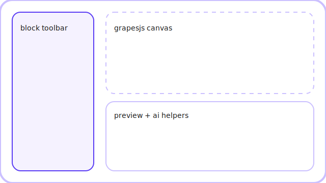
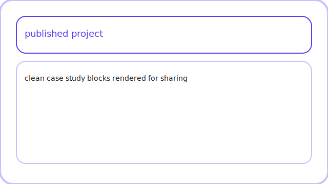

# PortfolioForge Monorepo

PortfolioForge delivers a modular case study editor (GrapesJS + Qwik/React) and Fastify API for managing projects, blocks, AI-assisted narratives, publishing, and PDF exports.




## Monorepo layout

```
apps/
  api/   → Fastify service (projects, blocks, files, narratives, templates, exports)
  web/   → Qwik + React editor with GrapesJS canvas
packages/
  schemas/ → shared Zod models
  ui/      → shared React primitives (Button, Input, Select, Card, Icon)
```

## Environment setup

Copy `.env.example` to `.env` at the repository root and provide the following:

- `DATABASE_URL` – Neon (or any PostgreSQL) connection string for Prisma models.
- `REDIS_URL` – Redis instance for narrative caching (in-memory fallback used when absent).
- `BLOB_BUCKET` / `BLOB_REGION` – R2/S3 bucket info for upload URLs (mocked locally).
- `OPENAI_API_KEY` / `ANTHROPIC_API_KEY` – model credentials (stubs accepted during local dev).

## Installation & development

This project uses npm workspaces (see `package.json#packageManager`). After installing dependencies:

```bash
npm install
npm run dev          # runs Fastify on :4000 and Qwik dev server on :5173
npm run dev:api      # api only
npm run dev:web      # web only
```

The editor is available at `http://localhost:5173/projects/{projectId}/edit` after creating a project from `/projects`.

## Scripts

```bash
npm run build   # builds api + web
npm run test    # runs package/api/web unit + e2e smoke tests
npm run seed    # seeds demo project with all block types
```

## Database & migrations

Prisma schema lives in `apps/api/src/db/prisma.schema`. Run `npm exec --workspace @portfolioforge/api prisma migrate dev` once you attach a Postgres database (Neon recommended). The Fastify services fall back to an in-memory store for local/demo usage.

## Testing & quality

- `packages/schemas/tests` validate block/project Zod contracts.
- `apps/api/tests/editorFlow.test.ts` covers end-to-end API flows (create → blocks → narrative → publish → export).
- `apps/web/tests/sanity.test.ts` ensures the web test runner is wired.

## Seed data

```bash
npm run seed
```

Creates a “demo product analytics” project showcasing text, media, timeline, chart, and impact blocks.

## Extending blocks

1. Add a Zod schema under `packages/schemas/src/block.ts`.
2. Update `AnyBlock` union and regenerate the UI form and GrapesJS preview in `apps/web/src/components/editor`.
3. Extend `BlockService` validation and `ExportService` PDF rendering.

## Accessibility & brand

- Flat, high-contrast palette (primary `#5a3cf4`, highlight `#cbc0ff`, charcoal text).
- Lowercase navigation without metaphors (New Projects, Templates, Published Projects, Updates).
- Keyboard-accessible buttons & form inputs.

## Changelog

See [`CHANGELOG.md`](CHANGELOG.md) for a summary of notable changes.
